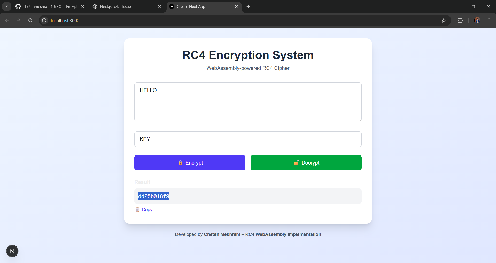
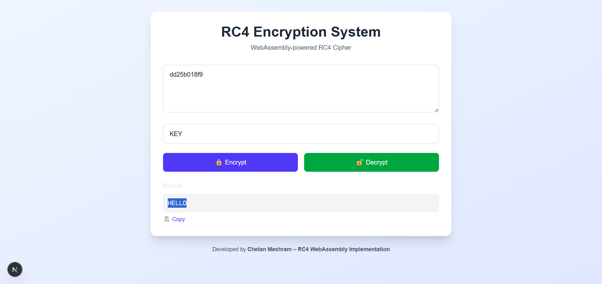

## 🔐 RC4 Encryption–Decryption System (WebAssembly)

**A WebAssembly-powered RC4 encryption and decryption system built using C (RC4 algorithm), Emscripten, and Next.js (React).
This project demonstrates how a low-level cryptographic algorithm written in C can be securely compiled to WebAssembly and executed efficiently inside the browser.
---**

## 📌 Project Overview
- RC4 algorithm is implemented purely in C
- Compiled to WebAssembly (WASM) using Emscripten
- Integrated with a Next.js frontend
- Supports:
  - 🔒 Encryption (Plaintext → Hex Ciphertext)
  - 🔓 Decryption (Hex Ciphertext → Plaintext)

- Runs entirely in the browser (no server-side cryptography)

## 🧠 Why WebAssembly?
  - ⚡Near-native performance in browser
  - 🔐 Secure memory execution
  - 🧩 Direct reuse of existing C code
  - 🌐 Cross-platform compatibility

---

### 🏗️ System Architecture

```
User Input (Text / Key)
        ↓
React UI (Next.js)
        ↓
JavaScript ↔ WebAssembly Bridge
        ↓
RC4 Algorithm (C)
        ↓
Encrypted / Decrypted Output
```

## 🛠️ Tech Stack

| Layer         | Technology                   |
| ------------- | ---------------------------- |
| Cryptography  | RC4 (C Language)             |
| WASM Compiler | Emscripten                   |
| Frontend      | Next.js (React + TypeScript) |
| Styling       | Tailwind CSS                 |
| Runtime       | Browser (WebAssembly)        |

## 📂 Project Structure
```
rc4-wasm-project/
│
├── app/
│   └── page.tsx              # Frontend UI + WASM integration
│
├── lib/
│   └── wasm/
│       └── rc4.js             # Emscripten-generated JS loader
│
├── public/
│   └── rc4.wasm               # WebAssembly binary
│
├── rc4.c                      # RC4 algorithm in C (UNMODIFIED)
├── package.json
├── next.config.ts
└── README.md
```
---

## ⚙️ Emscripten Setup (Windows)
1️⃣ Install Emscripten SDK
```    
git clone https://github.com/emscripten-core/emsdk.git
cd emsdk
emsdk install latest
emsdk activate latest
```
Activate environment (PowerShell):
```
emsdk_env.ps1
```

Verify installation:
```
emcc --version
```
---

## 🔧 Compile RC4 C Code to WebAssembly

**⚠️ Important:
The file rc4.c must NOT be modified.**

Run the following command from the project root:
```
emcc rc4.c -O3 \
-s MODULARIZE=1 \
-s EXPORT_ES6=1 \
-s ENVIRONMENT=web \
-s EXPORTED_FUNCTIONS='["_rc4_process","_allocate_memory","_free_memory"]' \
-s EXPORTED_RUNTIME_METHODS='["HEAPU8"]' \
-o lib/wasm/rc4.js
```

This generates:
- lib/wasm/rc4.js
- lib/wasm/rc4.wasm

Move the WASM file to public/:
```
move lib\wasm\rc4.wasm public\
```
---

## 🌐 How WebAssembly Is Loaded in Browser
- rc4.js is dynamically imported in page.tsx
- WebAssembly (rc4.wasm) is fetched from /public
- Memory is accessed via HEAPU8
- C functions are invoked directly from JavaScript
```
const createRC4Module = (await import("../lib/wasm/rc4")).default;
const module = await createRC4Module();
```
---

## 🚀 Run the Project
1️⃣ Install dependencies
```
npm install
```

2️⃣ Start development server
```
npm run dev
```
3️⃣ Open browser
```
http://localhost:3000
```

## 🧪 Sample Test Cases
  🔒 Encryption
  | Plaintext | Key | Output (Hex)           |
| --------- | --- | ---------------------- |
| HELLO     | KEY | (example) `dd25b018f9` |

  🔓 Decryption
| Ciphertext (Hex) | Key | Output |
| ---------------- | --- | ------ |
| dd25b018f9       | KEY | HELLO  |

---

## 🖥️ Application Preview

### 🔹 Encryption


### 🔹 Decryption


---

## 👨‍💻 Author

## **Chetan Meshram**

**Mtech IT IIITA Student | Blockchain & Cryptography Enthusiast**

🔗 GitHub: https://github.com/chetanmeshram10


---

## ⭐ Support
If you found this project useful:
- ⭐ Star the repository
- 🍴 Fork it
- 📢 Share
